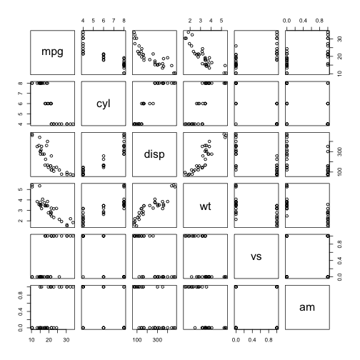

## Context
People care more about fuel efficiency than before when purchasing autos. This is not only because of on-going cost consciousness but also because of the rising environment protection sense. I've built this tiny shiny app to help people estimate MPG across various cars.
This app resides on an open data source(mtcars) and leverages a GLM machine learning algorism. 

--- .class #id 

## Exploratory Analysis

###### Note: Picked features cyl(Cylinder), disp(displacement), wt(weights), vs(vertical vs straight) and am(auto vs manual) to predict MPG

--- .class #id 

## Machine Learning Practice and prediction
Leveraged GLM algorism to build a prediction model. 
* modFit <- train(mpg ~ cyl + disp + wt + vs + am, method="glm", data=mtcars)
* predict(modFit,data.frame(cyl, disp, wt, vs, am))

--- .class #id 

## The shiny app
My tiny shiny app is located at here,
* https://tonywong99.shinyapps.io/Coursera/

By changing the parameters on the left side and then clicking the "SUBMIT" button, we can easily get the estimated MPG!
